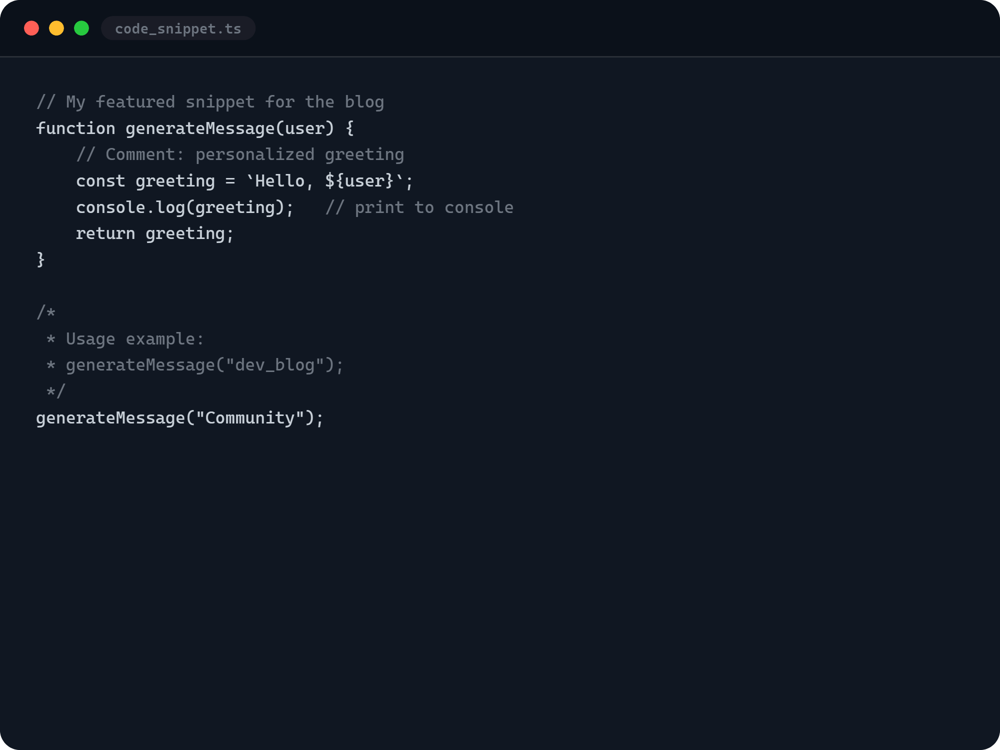

# CodeSnap · Code Rendering for Blogs

---

## Overview

Generate 4:3 landscape-format PNG images of code snippets with a minimalist IDE look. Ideal for illustrating technical posts, tutorials, or documentation on your blog.



---

## Features

- Live Editor: Paste your code and comments are automatically highlighted.
- Real-time preview of a mock IDE window.
- Dynamic resizing: the window automatically resizes to display **all the code without vertical scrolling** while maintaining the 4:3 aspect ratio.
- Export to high-definition PNG (2.5x scale) with a dark background and monospaced font.
- Minimalist dark theme inspired by GitHub Dark.
- Fully static: powered by pure HTML, CSS, and JavaScript.

---

## Project Structure

```
/
├── index.html      # Main structure
├── styles.css      # Styles
└── script.js       # Preview, resizing, and export logic
``` 

---

## Technologies

- HTML5 / CSS3 (CSS variables, Flexbox)
- JavaScript (ES6)
- [html2canvas](https://html2canvas.hertzen.com/) for PNG export

---
## How It Works

### Online use

1. Go to [mherreravsquez.github.io/codesnap/](https://mherreravsquez.github.io/codesnap/) 
2. Type or paste your code into the left panel.
3. View the preview in the right panel.
4. Click Export PNG to download the image.

### Local Use

1. Clone the repository:

   ```
   git clone https://github.com/mherreravsquez/codesnap.git
   cd codesnap
   ```
2. Open the index.html file in your browser.
3. Type or paste your code into the left panel.
4. View the preview in the right panel.
5. Click Export PNG to download the image.

---

## Customization

You can modify the CSS variables in `styles.css` within the `:root` block to change colors, fonts, borders, or the aspect ratio (currently 4:3). The dynamic resizing feature respects any aspect ratio defined in `resizeToFitContent()`.

---

## License

This project is open source and free to use for any streaming or personal purpose. No attribution required, but it is appreciated.

---

Created by [Marchel](https://mherreravsquez.github.io/)